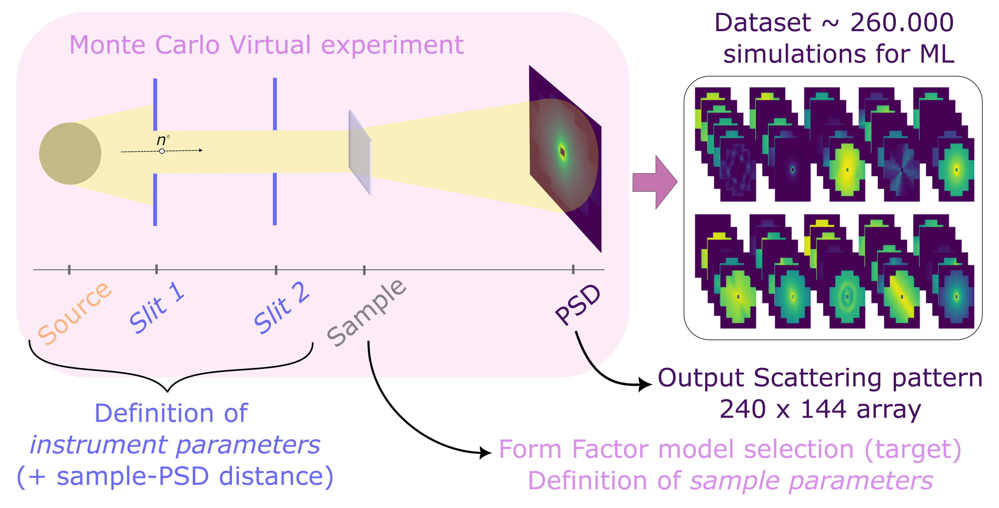

# Small Angle Scattering recommendation system based on CNNs and trained from Virtual Experiments



This repository is related to the [paper](https://www.nature.com/articles/s41598-024-65712-y) "Learning from virtual experiments to assist users of Small Angle Neutron Scattering in model selection"

The authors of the paper are [Jose Robledo](https://github.com/jorobledo), [Peter Willendrup](https://orbit.dtu.dk/en/persons/peter-kj%C3%A6r-willendrup), [Henrich Frielinghaus](https://www.fz-juelich.de/profile/frielinghaus_h), and [Klaus Lieutenant](https://www.fz-juelich.de/profile/lieutenant_k), and the code was written by Jose Robledo.

**Note** current software works well with PyTorch 2.2.1 .

If you found this repo useful, please [cite us](#citation). 


## Prerequisites
- python 3
- CPU or NVIDIA GPU (recommend GPU for acceleration of training, but testing may be done in the CPU)

## Installation
- Clone this repo:
```bash
git clone https://github.com/jorobledo/sas_recommendation_model
cd sas_recommendation_model
```
- Install [PyTorch](http://pytorch.org) and other dependencies:
```bash
pip install -r requirements.txt
```

## Download dataset
The full dataset of virtual experiments at the KWS-1 beamline of the FRM-II reactor in Garching used in our paper is published in Zenodo and can be [downloaded here](https://zenodo.org/records/10119316).

- Download the KWS-1 virtual experiments dataset from zenodo by running:
```bash
bash ./utils/get_data.sh
```
This will download the full dataset in the `data` folder. Make sure that the script is run from the current folder for a correct download path. If not, modify the download path in `./utils/get_data.sh` to the desired location. 

**note**: The dataset is large, therefore this might take a while.

## Instructions

To run the models as in the paper you will need the data and the pretrained parameters. Assuming you already downloaded the data and that it is in the `data` folder of repository directory and that you are standing in the main repo directory, you can run the following command to download the pre-trained parameters:
```bash
bash ./utils/get_pretrained.sh all
```
The keyword `all` may be changed to `resnet`, `densenet`, or `inception` to download only the specified model parameters. They will be downloaded in the parameters folder (in which `test.py` will search for them).

Once you are on a working environment with pytorch installed you can run
```bash
python test.py --batch_size=200 --avg_batches=5 --num_workers=4
```
Setting a smaller batch size will run faster, as well as averaging on less amount of batches. You can also set the number of workers for the dataloader (check the `test.py` script for further understanding). This should print out the average Top-1, Top-3, and Top5 accuracies for all of the models.

## Citation
If you use this code for your research, please cite our paper.

[1] J.I. Robledo, H. Frielinghaus, P. Willendrup and K. Lieutenant, *Learning from virtual experiments to assist users of Small Angle Neutron Scattering in model selection*, Scientific Reports 14 (2024), 14996. doi:https://doi.org/10.1038/s41598-024-65712-y.

BibTex:
```
@article{robledo2024learning,
  title={Learning from virtual experiments to assist users of Small Angle Neutron Scattering in model selection},
  author={Robledo, Jos{\'e} Ignacio and Frielinghaus, Henrich and Willendrup, Peter and Lieutenant, Klaus},
  journal={Scientific Reports},
  volume={14},
  number={1},
  pages={14996},
  year={2024},
  publisher={Nature Publishing Group UK London}
}
```
